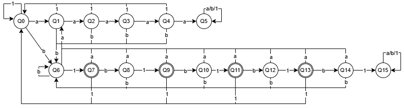
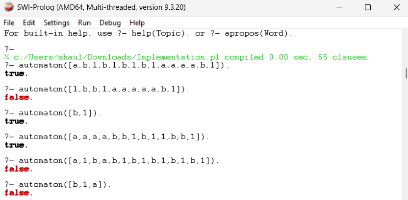

# Implementation of Lexical Analysis
Shaula Suhail Paz Garay - A01712013

## Description
This language is a math language which only accepts three characters: ab1. The rules for this language are:
1. It must en with *b1*
2. It must not contain *aaaaa*
3. It must not contain *b1b1b1b1b1*

As it has only three letters, the best aproach is to use a Non-Deterministic Finite Automaton (NFA).

## Automaton
The language can onlly accept combinations of three letters, so it can be defined as **Σ = 1,a,b**. Adding the expression of the previously stated rules, the Regular Language can be expressed as **`^(?!.*aaaaa)(?!.*b1b1b1b1b1).*b1$`**

Now that the rules are stablished, the next step is to implement the automaton using Q states. Merriam-Webster Dictionary defines an automaton as a "machine or control mechanism designed to follow automatically a predetermined sequence of operations or respond to encoded instructions" (Merriam-Webster, n.d.). The following image describes the automaton in a more visual way:

Added to the visul representation, the automaton can also be expressed with a table which may help to follow the right:
Initial State | Input | Final State
--- | --- | ---
Q0 | a | Q1
Q0 | b | Q6
Q0 | 1 | Q0
Q1 | a | Q2
Q1 | b | Q6
Q1 | 1 | Q0
Q2 | a | Q3
Q2 | b | Q6
Q2 | 1 | Q0
Q3 | a | Q4
Q3 | b | Q6
Q3 | 1 | Q0
Q4 | a | Q5
Q4 | b | Q6
Q4 | 1 | Q0
Q5 | a | Q5
Q5 | b | Q5
Q5 | 1 | Q5
Q6 | a | Q1
Q6 | b | Q6
Q6 | 1 | Q7
Q7 | a | Q1
Q7 | b | Q8
Q7 | 1 | Q0
Q8 | a | Q1
Q8 | b | Q6
Q8 | 1 | Q9
Q9 | a | Q1
Q9 | b | Q10
Q9 | 1 | Q0
Q10 | a | Q1
Q10 | b | Q6
Q10 | 1 | Q11
Q11 | a | Q1
Q11 | b | Q12
Q11 | 1 | Q0
Q12 | a | Q1
Q12 | b | Q6
Q12 | 1 | Q13
Q13 | a | Q1
Q13 | b | Q14
Q13 | 1 | Q0
Q14 | a | Q1
Q14 | b | Q6
Q14 | 1 | Q15
Q15 | a | Q15
Q15 | b | Q15
Q15 | 1 | Q15

## Implementation
To implement the automaton to a prolog file, it is important to translate our progress to prolog so we can test it.

`travel(InitialState, Input, NextState)`: Our first section defines how the atomaton will *travel* from one state to another, for example, in our first line we have `travel(q0,a,q1).` which means that our starting point is Q0 and if it detects an *a* it moves to Q1.

`final(FinalState)`: In this case we have multiple final states, which means that we need to declare it multiple times. The final states of this automaton is Q7, Q9, Q11, Q13. If the word is finished and we are positioned in any of the final states, this means the word has been approved.

`check([], Initial):- final(Initial).`: This version of check will check if the list is empty, and if this is the case, it will check if we are positioned on a final state. This wil tell us the final answer: if the word is accepted or not.

`check([Letter | Rest], Initial):- travel(Initial, Letter, Next), check(Rest, Next).`: This recursive function checks works as long as there are elements on the list. It separetes the first element and uses the *travel* functions to get the next state, then it calls the first *check* version and if the list is not empty, then it instead goes to itself again.

`automaton(Word):- check(Word, q0).`: This is the way we'll start the validation. It starts by sending the list to check with the initial state of Q0.

## Tests

## Complexity
The time complexity is O(n), as there are *n* number iof letters to check, which is the number of times the loop will be checked.

## References
Merriam-Webster. (n.d.). Automaton. In Merriam-Webster.com dictionary. Retrieved March 24, 2025, from https://www.merriam-webster.com/dictionary/automaton